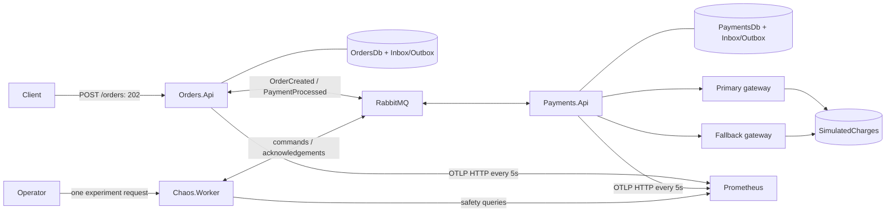

# ChaosLab.NET

[Português](README.pt-BR.md)

A .NET laboratory for asynchronous orders, durable payment idempotency and controlled chaos. Orders return `202 Accepted` after SQL persistence. Payment processing and status convergence happen through RabbitMQ.



Both gateways run inside Payments and share a durable charge ledger, committed independently of the consumer transaction. There is no external payment provider.

## Run

Requires Docker Compose with Linux containers (SQL Server: x86-64). Python 3 runs the demonstration. Local builds/tests need the .NET 10 SDK (10.0.112 or a newer compatible feature band) and ASP.NET Core 10 runtime. The pinned Docker SDK is 10.0.401; `global.json` permits this roll-forward.

```bash
cp .env.example .env  # first setup only; preserve an existing .env
# Generate a key once; preserve an existing key.
python3 -c 'import secrets; print("CHAOS_ADMIN_API_KEY=" + secrets.token_urlsafe(32))' >> .env
docker compose up -d --build --wait --wait-timeout 180
docker compose ps
python3 scripts/demo.py --scenario all --output artifacts/demo.json
```

| Interface | Address |
|---|---|
| Orders | http://localhost:5001 |
| Payments | http://localhost:5002 |
| Chaos control | http://localhost:5003/chaos |
| Prometheus | http://localhost:9090 |
| RabbitMQ management | http://localhost:15672 |
| SQL Server | localhost,1433 |

Published ports bind to localhost. Credentials come from your ignored `.env`. `GET /health` is liveness; `GET /health/ready` checks dependencies and returns 503 when degraded.

```bash
curl -i http://localhost:5001/orders -H 'Content-Type: application/json' \
  -d '{"customerId":"3fa85f64-5717-4562-b3fc-2c963f66afa6","amount":149.90}'
curl http://localhost:5001/orders/ORDER_ID
curl http://localhost:5002/payments/ORDER_ID
```

The initial status is `Pending`, followed by `Paid` or `PaymentFailed`. Customer ID must be nonempty; amount must be positive, fit decimal(18,2), and have at most two decimal places.

## Demonstrate chaos

The script supports `--scenario normal|latency|unavailable|rabbitmq|all`. It generates traffic, waits for safe metrics and cooldown, checks fallback/recovery, and verifies one charge per order in SQL. The RabbitMQ scenario stops the real broker and restores it in a `finally` block. Errors request abort; the target independently enforces TTL.

The `all` scenario ends by checking the kill switch. Reset explicitly with `docker compose restart payments-api chaos-worker` before another experiment.

Manual control (generate ten recent completed orders first):

```bash
export CHAOS_ADMIN_API_KEY="$(python3 -c 'from scripts.demo import admin_key; print(admin_key())')"
curl http://localhost:5003/chaos -H "X-Chaos-Api-Key: $CHAOS_ADMIN_API_KEY"
curl -i http://localhost:5003/chaos/experiments -H "X-Chaos-Api-Key: $CHAOS_ADMIN_API_KEY" -H 'Content-Type: application/json' \
  -d '{"fault":"Latency","durationSeconds":30,"latencyMilliseconds":2000}'
curl -X POST http://localhost:5003/chaos/abort -H "X-Chaos-Api-Key: $CHAOS_ADMIN_API_KEY"
curl -X POST http://localhost:5003/chaos/kill-switch -H "X-Chaos-Api-Key: $CHAOS_ADMIN_API_KEY"
```

One request creates at most one experiment. Every 5s the worker checks healthy services, data no older than 15s, ten completed orders/minute, final failures ≤5%, and end-to-end p95 ≤10s. It waits at most 60s for safe conditions. Activation requires Payments acknowledgement within 10s. Loss of safety requests abort. Duration defaults to 30s (maximum 60s), latency to 2s (maximum 5s), cooldown to 60s including startup. Chaos is disabled by default and blocked in Production. Compose enables Development mode without starting experiments.

## Reliability and limits

- Bus Outbox commits order and event together; Consumer Outbox/Inbox protects business handlers and their results.
- SQL uniqueness on `OrderId` protects payments and simulated charges. The first terminal order transition wins atomically.
- Polly per gateway: Retry → Circuit Breaker → Timeout. Two retries, exponential jitter from 200ms, 1s per attempt; circuit window 30s, minimum four attempts, 50% threshold, 10s break.
- Commercial declines and original cancellation do not retry or fall back. Infrastructure failures reconcile the ledger before fallback.
- Durable topology must exist before publishing. Compose starts Payments before Orders; `--deploy-topology` supports separate deployments.
- Messaging is at least once. The single-charge guarantee depends on the shared simulated ledger; independent real providers need provider idempotency and reconciliation.
- One worker and one Payments target are supported. Experiment state is process-local. Gateway calls hold a consumer transaction open; this is a bounded lab workload, not a throughput benchmark.

## Test and inspect

```bash
dotnet restore ChaosLab.NET.slnx
dotnet build ChaosLab.NET.slnx --no-restore -c Release
dotnet test ChaosLab.NET.slnx --no-build -c Release --logger trx --results-directory artifacts
dotnet test ChaosLab.NET.slnx --no-build -c Release --filter Category=Unit
dotnet test tests/ChaosLab.IntegrationTests --no-build -c Release --filter Category=Integration
dotnet test tests/ChaosLab.IntegrationTests --no-build -c Release \
  --filter FullyQualifiedName~Order_BrokerUnavailable_StillAcceptedAndDeliveredOnceBrokerReturns
```

Integration tests start their own containers, with a database and vhost per test. The broker recovery budget remains 120s. CI runs unit, integration and chaos tests plus the real Compose demonstration, publishing TRX and logs.

Metrics go directly from the stable OpenTelemetry OTLP/HTTP exporter to Prometheus, without a Collector. See [PromQL](docs/en/09-observability.md), [measured validation](docs/en/10-validation.md) and the [documentation index](docs/README.md).

Stack: net10.0, EF Core 10.0.12, MassTransit 8.5.10, Polly 8.6.1, OpenTelemetry 1.18.0, SQL Server 2022, RabbitMQ 3.13, Prometheus 3.5.0. Image digests and package versions are pinned. Grafana, a trace backend, YARP, Keycloak, Catalog, Redis and gRPC remain [future work](docs/en/08-roadmap.md).

W3C tracing covers HTTP, MassTransit, charges, reconciliation and chaos commands. Set `Telemetry__TracesEndpoint` to the full OTLP/HTTP URL, including `/v1/traces`; no additional backend is required. See [observability](docs/en/09-observability.md).
