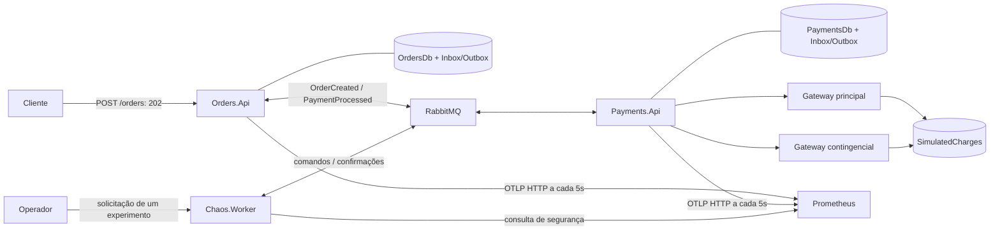

# ChaosLab.NET

[English](README.md)

Laboratório .NET de pedidos assíncronos, idempotência durável de pagamentos e caos controlado. Orders retorna `202 Accepted` após persistir no SQL. O pagamento e a atualização do pedido acontecem pelo RabbitMQ.



Os gateways ficam dentro de Payments e compartilham um registro durável, confirmado independentemente da transação do consumidor. Não há provedor externo de pagamentos.

## Executar

Requer Docker Compose com containers Linux (SQL Server: x86-64). A demonstração usa Python 3. Para build/testes locais, instale um SDK .NET 10 estável e o ASP.NET runtime .NET 8; `global.json` aceita versões compatíveis do SDK 10 para `.slnx`.

```bash
cp .env.example .env  # primeira execução; preserve um .env existente
docker compose up -d --build --wait --wait-timeout 180
docker compose ps
python3 scripts/demo.py --scenario all --output artifacts/demo.json
```

**PaymentsDb anterior às migrations?** Siga o [procedimento de backup e adoção explícita](docs/pt-BR/05-docker-environment.md#banco-payments-legado) antes de iniciar Payments. Schemas desconhecidos são recusados, sem recriar dados.

| Interface | Endereço |
|---|---|
| Orders | http://localhost:5001 |
| Payments | http://localhost:5002 |
| Controle de caos | http://localhost:5003/chaos |
| Prometheus | http://localhost:9090 |
| Administração RabbitMQ | http://localhost:15672 |
| SQL Server | localhost,1433 |

Todas as portas publicadas ficam em localhost. As credenciais vêm do `.env`, ignorado pelo Git. `GET /health` verifica liveness; `GET /health/ready` verifica dependências e retorna 503 quando degradado.

```bash
curl -i http://localhost:5001/orders -H 'Content-Type: application/json' \
  -d '{"customerId":"3fa85f64-5717-4562-b3fc-2c963f66afa6","amount":149.90}'
curl http://localhost:5001/orders/ORDER_ID
curl http://localhost:5002/payments/ORDER_ID
```

O estado inicial é `Pending`, seguido por `Paid` ou `PaymentFailed`. O cliente deve ter ID não vazio; o valor deve ser positivo, caber em decimal(18,2) e ter no máximo duas casas decimais.

## Demonstrar caos

O script aceita `--scenario normal|latency|unavailable|rabbitmq|all`. Ele gera tráfego, aguarda métricas seguras e cooldown, verifica fallback/recuperação e confirma uma cobrança por pedido no SQL. O cenário RabbitMQ para o broker real e o restaura em um bloco `finally`. Em caso de erro, solicita aborto; o alvo também impõe seu próprio TTL.

O cenário `all` termina verificando o kill switch. Para outro experimento, reinicie explicitamente com `docker compose restart payments-api chaos-worker`.

Controle manual (gere dez pedidos concluídos recentemente):

```bash
curl http://localhost:5003/chaos
curl -i http://localhost:5003/chaos/experiments -H 'Content-Type: application/json' \
  -d '{"fault":"Latency","durationSeconds":30,"latencyMilliseconds":2000}'
curl -X POST http://localhost:5003/chaos/abort
curl -X POST http://localhost:5003/chaos/kill-switch
```

Cada solicitação produz no máximo um experimento. A cada 5s o worker verifica serviços saudáveis, dados com até 15s, dez pedidos concluídos/minuto, falhas finais ≤5% e p95 ponta a ponta ≤10s. Aguarda até 60s por condições seguras. A ativação exige confirmação de Payments em até 10s. Perda de segurança solicita aborto. Defaults: duração 30s (máximo 60s), latência 2s (máximo 5s), cooldown 60s, inclusive após reinício. Caos fica desabilitado por padrão e bloqueado em Production. Compose habilita Development sem iniciar experimentos.

## Confiabilidade e limites

- Bus Outbox confirma pedido e evento juntos; Consumer Outbox/Inbox protege consumidores de negócio e seus resultados.
- Restrições SQL em `OrderId` protegem pagamentos e cobranças simuladas. A primeira transição terminal do pedido vence atomicamente.
- Polly por gateway: Retry → Circuit Breaker → Timeout. Duas retentativas com jitter exponencial desde 200ms, 1s por tentativa; janela de circuito 30s, mínimo de quatro tentativas, limiar 50%, abertura 10s.
- Recusas comerciais e cancelamento original não acionam retry/fallback. Falhas de infraestrutura consultam o registro antes do fallback.
- A topologia durável deve existir antes da publicação. Compose inicia Payments antes de Orders; `--deploy-topology` permite implantação separada.
- A entrega de mensagens é pelo menos uma vez. A cobrança única depende do registro simulado compartilhado; provedores reais independentes exigem idempotência e reconciliação próprias.
- Suporta um worker e um alvo Payments. O estado dos experimentos fica no processo. A chamada ao gateway mantém aberta a transação do consumidor; é um laboratório de carga limitada, não um benchmark de capacidade.

## Testar e observar

```bash
dotnet restore ChaosLab.NET.slnx
dotnet build ChaosLab.NET.slnx --no-restore -c Release
dotnet test ChaosLab.NET.slnx --no-build -c Release --logger trx --results-directory artifacts
dotnet test ChaosLab.NET.slnx --no-build -c Release --filter Category=Unit
dotnet test tests/ChaosLab.IntegrationTests --no-build -c Release --filter Category=Integration
dotnet test tests/ChaosLab.IntegrationTests --no-build -c Release \
  --filter FullyQualifiedName~Order_BrokerUnavailable_StillAcceptedAndDeliveredOnceBrokerReturns
```

Os testes de integração iniciam seus próprios containers e isolam banco e vhost por teste. O limite de recuperação do broker continua em 120s. A CI executa unitários, integração, caos e a demonstração real do Compose, publicando TRX e logs.

As métricas seguem diretamente do exporter estável OpenTelemetry OTLP/HTTP ao Prometheus, sem Collector. Consulte [PromQL](docs/pt-BR/09-observability.md), [validação medida](docs/pt-BR/10-validation.md) e o [índice](docs/README.md).

Stack: net8.0, EF Core 9.0.1, MassTransit 8.5.10, Polly 8.6.1, OpenTelemetry 1.18.0, SQL Server 2022, RabbitMQ 3.13 e Prometheus 3.5.0. Digests e versões dos pacotes estão fixados. Grafana, backend de traces, YARP, Keycloak, Catalog, Redis e gRPC seguem como [evoluções futuras](docs/pt-BR/08-roadmap.md).
