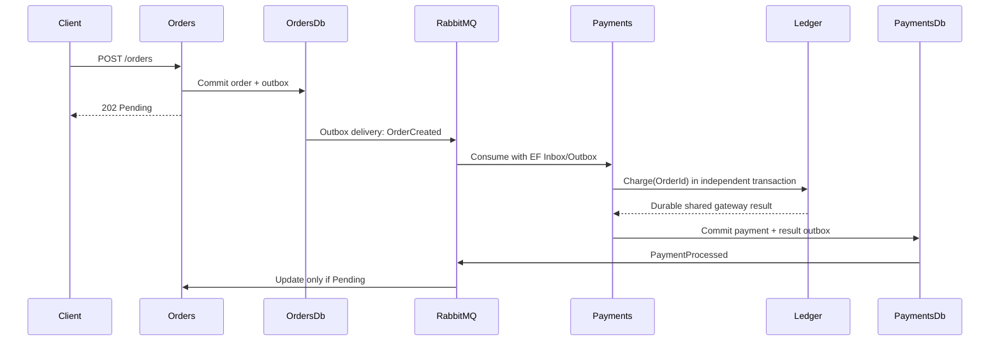

# Architecture

| Component | Responsibility | Storage |
|---|---|---|
| Orders.Api | Validate/accept orders; apply the first payment result | OrdersDb: Orders, InboxState, OutboxState, OutboxMessage |
| Payments.Api | Consume orders; execute resilient gateway; publish result | PaymentsDb: Payments, Inbox/Outbox, SimulatedCharges |
| Chaos.Worker | Query Prometheus, gate one requested experiment, observe ACK, abort | Process-local state |
| RabbitMQ | Durable business/control queues | rabbitdata volume |
| Prometheus | Receive OTLP metrics and answer PromQL | metricsdata volume |

There are no direct Orders→Payments HTTP calls, cross-service joins or distributed transactions. Both databases share one SQL Server instance in the lab. Gateways share the ledger inside PaymentsDb to model a charge surviving consumer rollback.

Worker state is deliberately process-local and supports a single worker/target instance. Restart discards pending work and starts a cooldown. Target TTL removes faults without relying on worker or broker availability. See [control behavior](03-message-flow.md).

## Internal organization

The five production projects remain. Domain folders contain models and rules without EF, ASP.NET or MassTransit. DbContexts and SQL/Polly gateways live in Infrastructure. Application contains charge contracts and Worker state coordination; endpoints and consumers adapt HTTP/messages without changing transaction boundaries.

ChaosCoordinator delegates validation to ExperimentValidator, synchronized transitions to ExperimentState, safety to ChaosSafetyPolicy and publication to ChaosCommandPublisher. ExperimentWorker owns polling and cancellation; PrometheusMonitor interprets HTTP responses. Messaging IO runs outside the state lock. Request trace context survives until dispatch, even after the HTTP response.

Experiment states, target notifications and gateways use separate enums. Serialization and persistence retain historical names. Architecture tests check domain dependencies, Shared.Contracts independence and acyclic project references.
