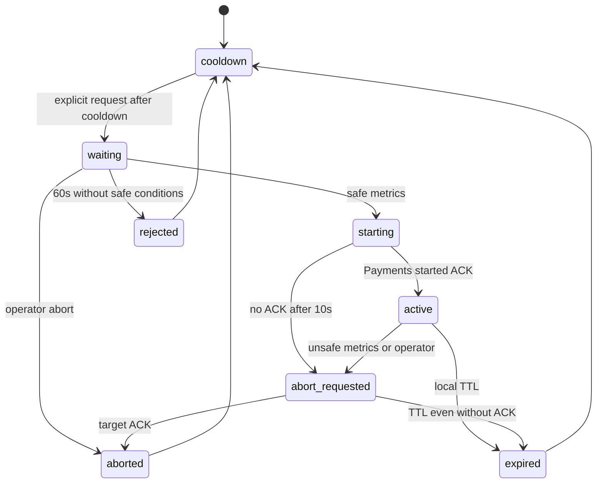

# Message flow and experiments

`OrderCreated` and `PaymentProcessed` retain their public contracts. Accepted orders start Pending; the first committed result changes them to Paid or PaymentFailed. Duplicate or competing results cannot overwrite a terminal state.

| Condition | Observable behavior |
|---|---|
| Broker down | POST returns 202 if SQL is available; outbox remains pending; readiness is 503 |
| Payments down | Events wait in its pre-provisioned durable queue |
| Consumer SQL write fails | Payment/result outbox roll back; no result reaches subscribers |
| Charge commits before consumer fails | Redelivery retrieves the durable charge |
| Primary unavailable, timeout or open circuit | Reconcile charge, then use fallback if absent |
| Commercial decline | PaymentFailed; no gateway retry/fallback |
| Original cancellation | Propagates; never becomes a decline |

## Control API

| Route | Result |
|---|---|
| GET /chaos | Enabled/kill switch, cooldown, current or last run, latest metric assessment |
| POST /chaos/experiments | JSON fault Latency or Unavailable, durationSeconds=30, latencyMilliseconds=2000; 202 with ExperimentId |
| POST /chaos/abort | Cancel pending request or request active abort; 202 |
| POST /chaos/kill-switch | Block new requests and publish global abort; 202 |

Invalid input returns 400; disabled, active or cooling-down state returns 409. All services also expose liveness and dependency readiness.

No automatic repetition. Commands include ExperimentId and an absolute expiry. Payments rejects expired/invalid commands and prevents duplicate starts from extending TTL. Abort interrupts artificial latency. Only the primary gateway is affected, before recording a charge. Kill switch stays set until the relevant processes restart. Metrics thresholds and safety defaults are listed in the README.

Control messages are diagnostic, not financially transactional. Local TTL bounds the effect when acknowledgements or abort messages cannot be delivered. Closed experiment tombstones are retained for the maximum command lifetime. Deliberately forged commands with reused IDs and rewritten future deadlines are outside the trusted localhost lab control model.

## Contracts and authorization

Existing Shared.Contracts types constitute v1: names, namespaces and MassTransit URNs are preserved. Compatible evolution adds optional fields with safe defaults; incompatible changes require new types/URNs without redefining v1. There is no custom envelope or artificial version field.

ChaosExperimentChanged retains started/expired/aborted/rejected. The Worker snapshot retains waiting/starting/active/abort_requested/expired/aborted/rejected. PaymentProcessed retains Success and primary/fallback gateway values; reasons are diagnostic text. New enum fields require JSON names; missing or unknown status/gateway values cannot trigger actions. ChaosFault retains numeric bus encoding and Latency/Unavailable HTTP names.

Every `/chaos` route uses the ChaosAdmin policy with X-Chaos-Api-Key, checked in constant time. Missing/incorrect credentials return 401 before endpoint execution. Authorized requests retain 202/400/409 and the Production restriction. Health checks are public. The key protects HTTP; RabbitMQ credentials remain the trust boundary for internal commands.
