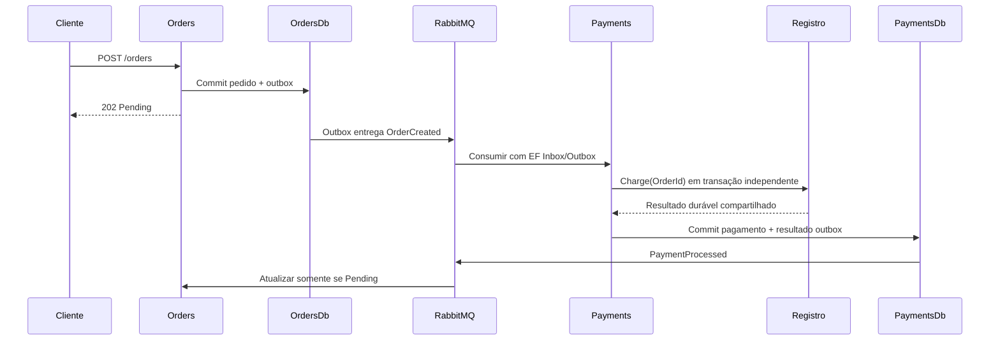

# Arquitetura

| Componente | Responsabilidade | Persistência |
|---|---|---|
| Orders.Api | Validar/aceitar pedidos; aplicar o primeiro resultado | OrdersDb: Orders, InboxState, OutboxState, OutboxMessage |
| Payments.Api | Consumir pedidos; executar gateway resiliente; publicar resultado | PaymentsDb: Payments, Inbox/Outbox, SimulatedCharges |
| Chaos.Worker | Consultar Prometheus, autorizar experimento solicitado, observar confirmação, abortar | Estado no processo |
| RabbitMQ | Filas duráveis de negócio/controle | Volume rabbitdata |
| Prometheus | Receber OTLP e responder PromQL | Volume metricsdata |

Não há chamadas HTTP diretas Orders→Payments, joins entre serviços ou transações distribuídas. Os dois bancos compartilham uma instância SQL no laboratório. Os gateways compartilham um registro em PaymentsDb para modelar uma cobrança que sobrevive ao rollback do consumidor.

O worker suporta uma instância de worker/alvo, com estado no processo. Reinício descarta pendências e inicia cooldown. O TTL do alvo remove falhas sem depender do worker ou broker. Consulte o [controle](03-message-flow.md).

## Organização interna

Os cinco projetos de produção permanecem. Pastas Domain contêm modelos e regras sem EF, ASP.NET ou MassTransit. DbContexts e gateways SQL/Polly ficam em Infrastructure. Application contém os contratos de cobrança e a coordenação de estado do Worker; endpoints e consumidores adaptam HTTP/mensagens sem mudar as fronteiras transacionais.

ChaosCoordinator delega validação a ExperimentValidator, transições sincronizadas a ExperimentState, segurança a ChaosSafetyPolicy e publicação a ChaosCommandPublisher. ExperimentWorker controla polling e cancelamento; PrometheusMonitor interpreta respostas HTTP. IO de mensageria ocorre fora do bloqueio de estado. O contexto de tracing da solicitação é conservado até o despacho, mesmo depois da resposta HTTP.

Estados de experimento, notificações do alvo e gateways são enums distintos. Serialização e persistência conservam os nomes anteriores. Testes arquiteturais verificam dependências do domínio, autonomia de Shared.Contracts e ausência de ciclos entre projetos.
