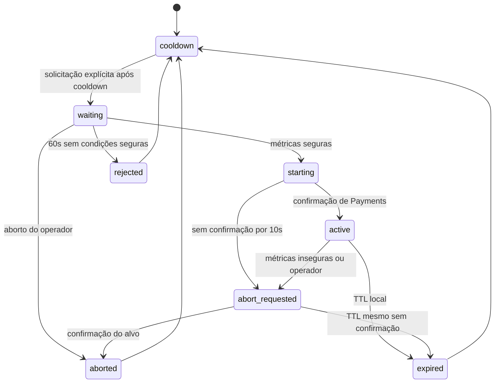

# Fluxo de mensagens e experimentos

OrderCreated e PaymentProcessed preservam seus contratos públicos. Pedidos aceitos começam Pending; o primeiro resultado confirmado altera para Paid ou PaymentFailed. Resultados repetidos ou concorrentes não sobrescrevem estados terminais.

| Condição | Comportamento observável |
|---|---|
| Broker fora | POST retorna 202 se SQL disponível; Outbox aguarda; readiness retorna 503 |
| Payments fora | Eventos aguardam na fila durável previamente provisionada |
| Gravação SQL do consumidor falha | Pagamento/Outbox sofrem rollback; resultado não chega aos assinantes |
| Cobrança confirmada antes de falha do consumidor | Reentrega recupera a cobrança durável |
| Principal indisponível, timeout ou circuito aberto | Consultar cobrança; fallback se ausente |
| Recusa comercial | PaymentFailed, sem retry/fallback do gateway |
| Cancelamento original | Propagado, nunca convertido em recusa |

## API de controle

| Rota | Resultado |
|---|---|
| GET /chaos | Habilitação/kill switch, cooldown, execução atual ou última, avaliação de métricas |
| POST /chaos/experiments | JSON fault Latency ou Unavailable, durationSeconds=30, latencyMilliseconds=2000; 202 com ExperimentId |
| POST /chaos/abort | Cancela pendência ou solicita aborto ativo; 202 |
| POST /chaos/kill-switch | Bloqueia novas solicitações e publica aborto global; 202 |

Entrada inválida retorna 400; desabilitado, ocupado ou em cooldown retorna 409. Todos os serviços expõem liveness e readiness de dependências.

Não há repetição automática. Comandos incluem ExperimentId e prazo absoluto. Payments rejeita comandos expirados/inválidos e impede que duplicatas estendam TTL. Abort interrompe a latência artificial. Somente o principal é afetado, antes de registrar cobrança. O kill switch dura até o reinício dos processos correspondentes. Defaults e limites estão no README.

Mensagens de controle são diagnósticas, sem transação financeira. O TTL local limita a falha quando confirmação ou aborto não chegam. Identificadores encerrados ficam retidos pelo tempo máximo de validade dos comandos. Comandos deliberadamente forjados com IDs reutilizados e novos prazos ficam fora do modelo de controle confiável do laboratório em localhost.

## Contratos e autorização

Os tipos existentes em Shared.Contracts constituem v1: nomes, namespaces e URNs MassTransit são preservados. Evoluções compatíveis acrescentam campos opcionais com defaults seguros; alterações incompatíveis precisam de novos tipos/URNs, sem redefinir v1. Não há envelope próprio nem campo artificial de versão.

ChaosExperimentChanged mantém status started/expired/aborted/rejected. O snapshot do Worker mantém waiting/starting/active/abort_requested/expired/aborted/rejected. PaymentProcessed mantém Success e gateway primary/fallback; motivos são texto diagnóstico. Os novos enums exigem nomes JSON; status/gateway ausentes ou desconhecidos não podem iniciar ações. ChaosFault mantém a representação numérica no bus e nomes Latency/Unavailable no HTTP.

Todo `/chaos` usa a política ChaosAdmin com chave em X-Chaos-Api-Key, validada em tempo constante. Credencial ausente/incorreta retorna 401 antes de executar o endpoint. Solicitações autorizadas preservam 202/400/409 e o bloqueio em Production. Health checks são públicos. A chave protege HTTP; credenciais RabbitMQ continuam sendo a fronteira de confiança dos comandos internos.
